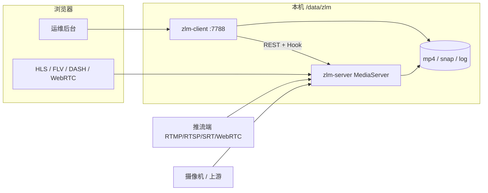

# ZLM 运维套件

面向 **ZLMediaKit** 的一站式流媒体运维方案：底层是带 WebRTC / SRT / FFmpeg 的媒体服务器，上层是 Go 写的运维后台。推、拉、转、录、鉴权、截图、协议接入都可以在浏览器里完成。

| 组件 | 说明 | 默认入口 |
| --- | --- | --- |
| **zlm-server** | 基于 ZLMediaKit 的 `MediaServer` | HTTP API `8090` · RTMP `1935` · RTSP `554` · SRT `9000` · WebRTC `8000` |
| **zlm-client** | 运维后台（本仓库 `zlm-client`） | HTTP `http://localhost:7788` · HTTPS `7789` |



---

## 目录

- [技术栈](#技术栈)
- [功能一览](#功能一览)
- [目录与运行时](#目录与运行时)
- [端口](#端口)
- [环境要求](#环境要求)
- [推荐部署](#推荐部署)
- [日常运维](#日常运维)
- [自行编译部署](#自行编译部署)
- [登录与配置](#登录与配置)
- [开发与测试](#开发与测试)

---

## 技术栈

### 媒体服务 `zlm-server`

| 层级 | 技术 |
| --- | --- |
| 核心 | [ZLMediaKit](https://github.com/ZLMediaKit/ZLMediaKit) `MediaServer`（C++ / CMake / Release） |
| 协议 | RTMP · RTSP · HTTP-FLV · HLS · HTTP-TS · fMP4 · SRT · WebRTC · RTP / GB28181 |
| 依赖 | OpenSSL（静态）· zlib · **libsrtp2**（WebRTC 硬依赖）· FFmpeg |
| 构建 | `zlm-server/build.zlm.sh`：拉源、编 libsrtp2、CMake 打开 `ENABLE_WEBRTC` / `ENABLE_SRT` / `ENABLE_FFMPEG` |

### 运维后台 `zlm-client`

| 层级 | 技术 |
| --- | --- |
| 语言 / 运行时 | Go **1.23**，模板与静态资源 `embed` 进单一二进制 |
| Web 框架 | [Gin](https://github.com/gin-gonic/gin) |
| 页面 | Go `html/template` + [HTMX](https://htmx.org/)（局部刷新、不整页重载） |
| 表格 / 图 | Tabulator · ECharts |
| 播放 | mpegts.js（HTTP-FLV / MSE）· hls.js · dash.js · 浏览器 WebRTC |
| 样式 | 自研 `theme.css`（亮/暗色）+ Tailwind CDN 配色扩展 |
| 存储 | [bbolt](https://github.com/etcd-io/bbolt) 本地 KV（Token、IP 名单、部分运维状态） |
| 日志 | zap + 滚动文件 |
| 进程 | systemd（`Restart=always`），脚本 `control.sh` |

---

## 功能一览

侧栏是完整菜单；侧栏模式下内容区顶栏只显示**点过的 Tab**，可 × 关闭。支持顶栏 / 侧栏布局切换、亮暗主题。

### 系统概览

- 本机节点状态、在线流、推拉并发
- 趋势图：推流 / 拉流 / 连接数，媒体码率，网卡吞吐（分时 · 1 天 · 3 天 · 7 天）
- 直播封面：定时 ffmpeg 截图（鉴权开启时自动带播放 Token）

### 直播管理

- 在线流列表：编码、分辨率、帧率、GOP、音视频码率、推流协议、播放客户端
- 浏览器预览：HTTP-FLV / HLS / fMP4 / DASH / WebRTC 等，URL 按协议正确附带 Token
- 展开连接：踢掉会话；对端一键加入 **黑名单 / 白名单**（黑名单同时禁推禁拉并踢光该 IP）
- 关闭流、查看媒体详情

### 连接管理

- 按关联流分组的会话表，排序 / 搜索 / 分页
- 单踢、按 IP 或本地端口批量踢、勾选踢出
- 对端黑白名单（推拉同时生效）

### 信号转发

- **拉流代理**：RTSP / RTMP / HLS / HTTP-TS / HTTP-FLV；HTTP-MP4 等自动改走 FFmpeg
- **推流代理**：把本机流再转推出去
- **FFmpeg 源**：自定义命令拉入本机

### 协议管理

- **ONVIF**：扫描摄像机，导入为拉流
- **WebRTC**：房间 / Keeper 管理
- **RTP / GB28181**：开端口、SSRC、主被动 TCP、对讲、发送等

### 录制管理

- MP4 / HLS / HLS-fMP4 启停录制
- 录像浏览、下载、批量删除
- 点播加载到 ZLM（seek / 倍速）
- 文件预览播放

### 配置管理

- 运维台路径：工作目录、二进制、`config.ini`、日志、API
- ZLM 自身 ini：基础 / 集群 / 协议 / 插件，校验后保存，可热加载或重启服务

### 推流管理

- 浏览器采集摄像头 / 屏幕，WebRTC 推到本机
- 推流、拉流播放、回显（先推再拉）

### 鉴权管理

- **IP 限制**（优先于 Token）
  - 关闭：全部放行
  - 放行模式：默认放行，命中黑名单拒绝
  - 禁止模式：默认拒绝，仅白名单放行
- **Token**：只约束已填写的 App/Stream；范围为「全部」时所有流都要 `?token=`
- WebRTC Token 走信令 / WHEP，不塞进 `webrtc://`
- SRT Token 写入 `streamid`
- HLS/DASH 播放列表校验 Token，切片连续性请求不重复拦
- 定时截图与 DASH 转封装在鉴权变更后自动带上 Token 并重启任务

### 事件日志

- Hook 事件流、运维台 / 媒体服务日志实时查看与过滤

---

## 目录与运行时

仓库（开发 / 编译）与线上运行目录分离：

```text
zlmediakit/                      源码
├── control.sh                   启停 / 编译 / 发布 / systemd
├── start.sh                     等价于 ./control.sh zlm start
├── zlm-server/
│   ├── build.zlm.sh             编译 MediaServer
│   └── ZLMediaKit/              上游源码（构建脚本拉取）
├── zlm-client/                  运维后台 Go 工程
│   ├── core/config/config.toml  配置模板
│   └── web/                     模板与静态资源
└── thr3parts/systemd/           unit 模板
```

正式运行只使用（可用环境变量 `ZLM_DATA` 改根目录，默认 `/data/zlm`）：

```text
/data/zlm/
├── bin/zlm-server               MediaServer 二进制
├── bin/zlm-client               运维后台二进制
├── cfg/zlm-server.ini           媒体服务配置
├── cfg/zlm-client.toml          运维台配置
├── log/zlm-server/              媒体服务日志
├── log/zlm-client.out           运维台 stdout
├── mp4/                         录像
└── snap/                        截图
```

`update` 会先停服务，再编译并拷贝到上述目录后拉起。已有 `zlm-server.ini` / `zlm-client.toml` **不会被覆盖**。

---

## 端口

| 服务 | 端口 | 用途 |
| --- | ---: | --- |
| zlm-client | 7788 | 运维后台 HTTP |
| zlm-client | 7789 | 运维后台 HTTPS |
| zlm-server | 8090 | HTTP / API / HLS / HTTP-FLV |
| zlm-server | 8443 | HTTPS |
| zlm-server | 1935 | RTMP |
| zlm-server | 554 | RTSP |
| zlm-server | 9000 | SRT |
| zlm-server | 8000 | WebRTC |

防火墙请按实际推拉协议放行；运维台至少放行 `7788`（或 `7789`）。

---

## 环境要求

- **Linux** + **systemd**（生产用 `control.sh`；需 root、免密 `sudo -n`，或可用的 user systemd）
- 编译 zlm-server：`git` · `cmake` · `make` · C++ 工具链 · zlib 开发包
- 编译 zlm-client：**Go 1.23+**、`python3`（发布时改写 toml 路径）
- **FFmpeg**（截图、DASH、部分拉流；可在 `zlm-client.toml` 的 `basic.ffmpeg` 指定）
- OpenSSL / libsrtp2：构建脚本会按本机路径解析，缺 libsrtp2 时会本地编译

`build.zlm.sh` 里 OpenSSL、FFmpeg、libsrtp 前缀可按机房修改后再编。

---

## 推荐部署

在仓库根目录执行：

```bash
# 1. 编译 ZLMediaKit（含 WebRTC / SRT）
cd zlm-server && ./build.zlm.sh && cd ..

# 2. 编译两边、发布到 /data/zlm、安装 systemd 并启动
./control.sh zlm update
```

也可以分步：

```bash
./control.sh zlm-server update    # 只更新媒体服务
./control.sh zlm-client update    # 只更新运维台
```

浏览器打开：

```text
http://localhost:7788/
```

登录：

| 项 | 值 |
| --- | --- |
| 用户 | `admin` |
| 密码 | ZLM `api.secret`，即 `/data/zlm/cfg/zlm-server.ini` 里 `[api] secret` |

```bash
grep -E '^\s*secret' /data/zlm/cfg/zlm-server.ini
```

`start.sh` 等同于 `./control.sh zlm start`（要求运行文件已经发布过）。

---

## 日常运维

```text
./control.sh zlm          start|stop|restart|reload|status|update
./control.sh zlm-server   start|stop|restart|reload|status|update
./control.sh zlm-client   start|stop|restart|status|update
```

| 动作 | 含义 |
| --- | --- |
| `start` / `stop` / `restart` | 经 systemd 启停；**不要直接 kill**，`Restart=always` 会立刻拉起 |
| `reload` | 仅 zlm-server：按磁盘上的 ini 调 `reloadServerConfig` |
| `status` | `systemctl status` |
| `update` | 停止 → 编译 → 拷到 `/data/zlm` → 启动 |

数据根目录：

```bash
export ZLM_DATA=/data/zlm          # 默认值
./control.sh zlm status
```

---

## 自行编译部署

适合没有 systemd、或要把二进制放到自定义路径的环境。

**1. 媒体服务**

```bash
cd zlm-server && ./build.zlm.sh
# 产物一般在：
#   zlm-server/MediaServer
#   zlm-server/ZLMediaKit/release/linux/Release/MediaServer
#   zlm-server/config.ini
```

**2. 运维台**

```bash
cd zlm-client
GOWORK=off go build -trimpath -o zlm-client .
```

**3. 改配置**，让运维台指向你的 MediaServer 与 ini：

编辑 [`zlm-client/core/config/config.toml`](zlm-client/core/config/config.toml)：

```toml
listen = ":7788"

[basic]
  port = 7788
  https_port = 7789
  enable_dash = false
  enable_snap = true
  snap_interval = 30
  ffmpeg = "/usr/bin/ffmpeg"          # 改成实际路径

[[nodes]]
  id = "zlm-1"
  name = "本机 ZLM"
  api = "http://127.0.0.1:8090"
  http_port = 8090
  rtsp_port = 554
  rtmp_port = 1935
  srt_port = 9000
  webrtc_port = 8000
  ini = "/path/to/config.ini"
  log_dir = "/path/to/zlm-server/log"
  root = "/path/to/zlm-server"
  bin = "/path/to/MediaServer"
```

`secret` 可留空：运维台会从 `ini` 的 `[api] secret` 读取，登录密码与 API 密钥一致。

**4. 启动**

```bash
# 媒体服务（示例，线程数按机器调整）
./MediaServer -c /path/to/config.ini -t 16 --log-dir /path/to/log

# 运维台
./zlm-client -config /path/to/zlm-client.toml
```

---

## 登录与配置

- Cookie 会话名 `zlm_admin`，约 14 天；未登录访问页面会跳到 `/login`
- Hook（`/hook/*`、`/index/hook/*`）给 ZLM 回调，不走登录页
- 生产请保证 `zlm-server.ini` 的 `secret` 足够随机，并限制 `8090` 仅本机或内网可达
- 运维台 HTTPS 证书可从后台下载 `admin.crt`（自签场景）

常用配置键（`zlm-client.toml`）：

| 键 | 作用 |
| --- | --- |
| `basic.enable_snap` / `snap_interval` | 定时截图开关与间隔（秒，约 5–300） |
| `basic.enable_dash` | 自动 DASH 转封装 |
| `basic.ffmpeg` | ffmpeg 可执行文件 |
| `nodes[].api` | ZLM HTTP API，如 `http://127.0.0.1:8090` |
| `nodes[].ini` / `bin` / `root` | 配置、二进制、工作目录，供配置页与重启使用 |

---

## 开发与测试

```bash
cd zlm-client
GOWORK=off go test ./...
```

静态资源带版本参数（如 `theme.css?v=ops-layout-64`），改 CSS/JS 后需同步提升，避免浏览器缓存旧文件。

---

## 许可与上游

- 运维台与本仓库脚本：按本仓库许可使用
- 媒体内核遵循 [ZLMediaKit](https://github.com/ZLMediaKit/ZLMediaKit) 及其第三方组件许可
